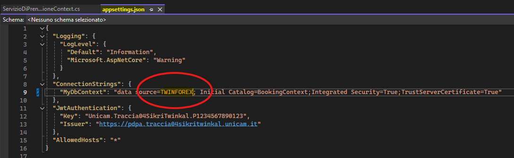

# Progetto -  Traccia N04 

Realizzazione di una web api che permetta la prenotazioni di risorse (auto, sale riunioni etc).

L'applicazione deve avere un elenco di utenti con le seguenti proprietà :
- Email
- Nome 
- Cognome
- Password

Una risorsa ha le seguenti proprietà :
- Nome
- Tipologia (auto, sala riunione) da gestire su tabella separata

Le api che dovranno essere realizzate sono le seguenti :
 - Creazione di un utente (anonima senza autenticazione)
 - Autenticazione
 - Creazione di una risorsa
 - Prenotazione di una risorsa da data a data. La prenotazione deve essere possibile solamente se la risorsa è libera nell'intervallo di tempo specificato

 - Ricerca delle disponibilità.Questa api deve restituire tutte le risorse disponibili all'interno dell'intervallo di tempo specificato.
   Questa chiamata deve prevedere i seguenti parametri :
   Data Inizio (obbligatorio)
   Data Fine (obbligatorio)
   Codice Risorsa (opzionale)
   
   La ricerca dovrà paginare i risultanti, in base ad un parametro passato nella chiamata

## How to
 Clonata la repository, aprire la directory sul proprio IDE e modificare la stringa di connessione per interfacciarsi con il database SQL locale. L'ideale sarebbe aprire la SOLUZIONE (il file .sln) tramite Visual Studio, oppure, se si vuole, clonare la repo direttamente da lì.

 ### Stringhe di connessione  
  **Path**: Traccia_04_Sikri_Twinkal.Web -> `appsettings.js` (file da editare)
  
  

 Una volta fatto questo, avviare il `Program.cs`, presente nella directory Traccia_04_Sikri_Twinkal.Web, che avvierà Swagger in localhost e avverrà la creazione del database "`BookingContext`" nel server locale, designato e registrato nei file citati precedentemente. 
 
 Verficare che venga visualizzata in locale l'interfaccia di Swagger, per fare successivamente le prove del caso.

 ### Operazioni                                                             
  Visualizzato correttamente Swagger, si possono fare le varie operazioni richieste dalla traccia:
  - Creazione di un utente (anonima senza autenticazione)
  - Autenticazione (SignIn -> Rilascio token -> Autenticazione tramite l'interfaccia di Swagger, con Bearer JWT)
  - Creazione di una tipolgia di risorsa (Solo se autorizzati, da fare prima di creare una risorsa della tipologia desiderata, altrimenti non si avrebbe l'id della tipologia di risorsa di riferimento)
  - Creazione di una risorsa (Solo se autorizzati)
  - Prenotazione di una risorsa da data a data (Solo se autorizzati)
  - Ricerca delle disponibilità (Solo se autorizzati)

In caso di necessità è presente una cartella contenente il dump del DB utilizzato. (DumpSSMS - BookingContext/`ScriptDump.sql` - `BookingContext.bak`)

 
